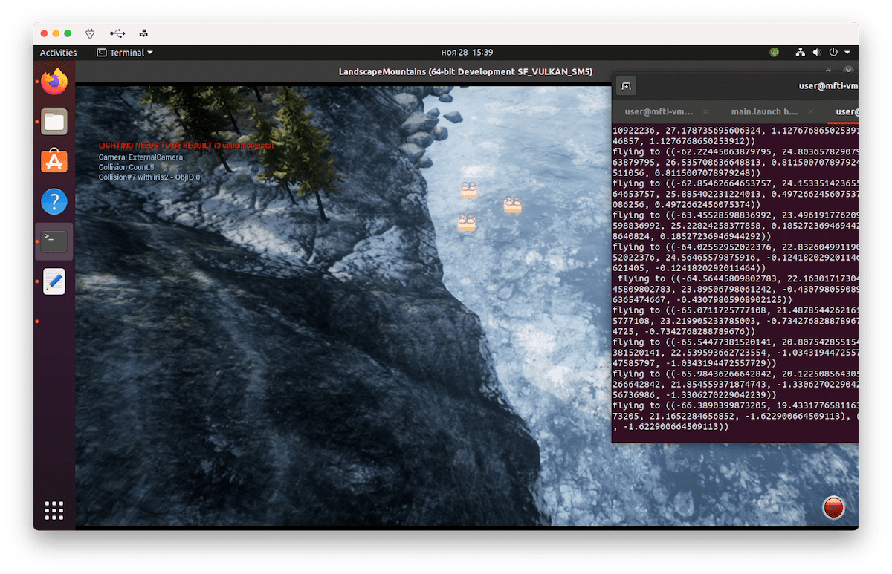

# drone-games

Task:

* https://github.com/acsl-mipt/drone-games/blob/main/.resources/TASK_5.md
* https://github.com/acsl-mipt/drone-games/blob/main/.resources/TASK_5_2.md



## Installation

Create catkin workspace for Clover packages:

```bash
mkdir -p ~/clover_ws/src
cd ~/clover_ws/
catkin_make
```

Clone Clover repo:

```bash
cd clover_ws/src
git clone https://github.com/CopterExpress/clover.git
```

Build `simple_offboard` target:

```bash
cd ~/clover_ws
catkin_make simple_offboard -DCATKIN_WHITELIST_PACKAGES=clover
catkin_make clover_generate_messages
```

Install dependencies:

```bash
sudo apt install geographiclib-tools
sudo geographiclib-get-geoids egm96-5
pip3 install PyGeodesy
pip3 install scipy
```

Replace `px4_num.launch` in `~drone-games/multiple-sitl/mavros` with `px4_num.launch` in this directory.

Upload parameters from `day2_1_cargo.params` to all drones OR replace `~/drone-games/airsim/settings.json` with `settings.json` in this directory.

## Running

Source clover_ws setup.bash:

```bash
source ~/clover_ws/devel/setup.bash
```

Run services:

```bash
roslaunch main.launch
```

Wait until mavros and all global position are initialized.

Run script:

```bash
python3 flight.py
```

## Misc

Run simple_offboard:

```bash
roslaunch offboard.launch num:=X
```

Run 3 simple_offboard's:

```bash
roslaunch main.launch
```
